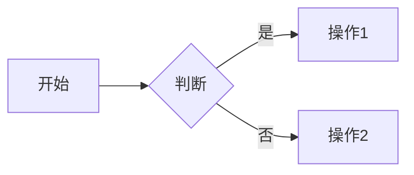

# 常见问题

## 账户与空间

### 个人空间和团队空间有什么区别？

**个人空间：**
- 仅个人可见
- 适合私人笔记
- 可选择性分享

**团队空间：**
- 团队成员可见
- 支持协作编辑
- 统一权限管理

### 如何转移空间所有权？

1. 进入空间设置
2. 点击「转移所有权」
3. 选择新所有者
4. 确认转移

⚠️ **注意**：只有所有者可以执行此操作

### 空间容量限制？

**存储限制：**
- 免费版: 10 GB
- 标准版: 100 GB
- 企业版: 1 TB
- 私有部署: 无限制

**单文件限制：**
- 文档: 无限制
- 附件: 100 MB/文件

## 文档编辑

### 支持哪些文档格式？

**在线编辑：**
- Markdown
- 富文本
- 表格

**查看预览：**
- Office: Word、Excel、PPT
- PDF
- 图片: JPG、PNG、GIF
- 视频: MP4

### 如何插入数学公式？

**方法1: LaTeX**
```
行内公式: $E=mc^2$
块级公式:
$$
\int_0^1 x^2 dx
$$
```

**方法2: 公式编辑器**
```
点击「插入」→「公式」→ 使用可视化编辑器
```

### 如何绘制流程图？

**使用 Mermaid：**
````markdown

````

**插入图片：**
```
使用外部工具绘制 → 导出图片 → 插入文档
```

## 协作问题

### 如何解决编辑冲突？

**自动合并：**
- 不同段落：自动合并
- 相同段落：提示冲突

**手动解决：**
```
1. 系统提示冲突
2. 查看冲突内容
3. 选择保留的版本
4. 保存文档
```

### 评论通知收不到？

**检查设置：**
1. 进入「个人设置」→「通知」
2. 确认通知开关已打开
3. 检查邮箱地址正确
4. 查看垃圾邮件文件夹

### 如何禁用他人编辑？

**方法1: 修改权限**
```
文档设置 → 权限 → 改为「仅查看」
```

**方法2: 锁定文档**
```
文档设置 → 锁定编辑
```

## 搜索问题

### 搜索找不到文档？

**检查：**
1. **权限**：是否有访问权限
2. **索引**：文档是否已索引（新文档需要几分钟）
3. **关键词**：尝试其他关键词
4. **筛选**：检查筛选条件

### 如何提高搜索准确性？

**技巧：**
```
精确匹配: "完整关键词"
排除词: 关键词 -排除
组合: 关键词1 AND 关键词2
```

### 搜索速度慢？

**优化建议：**
1. 使用更具体的关键词
2. 添加筛选条件
3. 减少搜索范围

## 版本问题

### 版本保留多久？

**保留策略：**
- 最近30天：所有版本
- 30天-1年：每天一个版本
- 1年以上：每月一个版本

**重要版本：**
手动标记的版本永久保留

### 如何对比多个版本？

**两两对比：**
```
版本A vs 版本B
版本B vs 版本C
...
```

**查看演进：**
```
使用时间轴查看文档演进过程
```

### 误删文档如何恢复？

**方法1: 回收站**
1. 进入回收站
2. 找到文档
3. 点击「恢复」

**方法2: 版本历史**
```
如果文档被完全删除，联系管理员
管理员可从备份恢复
```

## 权限问题

### 如何设置不同级别的访问权限？

**文档级别：**
```
用户A: 完全访问
用户B: 可编辑
用户C: 可评论
用户D: 仅查看
```

**目录级别：**
```
设置目录权限 → 子文档自动继承
```

### 分享链接如何设置密码？

1. 创建分享链接
2. 勾选「需要密码」
3. 设置密码（建议6位以上）
4. 分享链接和密码

### 如何批量修改权限？

1. 选择多个文档
2. 右键「批量操作」
3. 选择「修改权限」
4. 设置新权限
5. 应用

## 导入导出

### Word 文档导入后格式乱了？

**常见问题：**

1. **复杂格式**
   - 简化 Word 格式
   - 手动调整

2. **自定义样式**
   - 使用标准样式
   - 转为 Markdown

3. **嵌入对象**
   - 提取为单独文件
   - 重新插入

### 如何批量导出文档？

**方法1: 选择导出**
```
选择多个文档 → 批量导出 → 选择格式
```

**方法2: 目录导出**
```
选择目录 → 导出整个目录 → 生成压缩包
```

### 导出的 PDF 格式不对？

**优化设置：**
```
导出选项:
- 页面大小: A4
- 边距: 标准
- 是否包含评论: 否
- 是否包含封面: 是
```

## 性能问题

### 大文档编辑卡顿？

**优化建议：**

1. **文档拆分**
   ```
   大文档 → 多个小文档 → 目录组织
   ```

2. **减少图片**
   ```
   压缩图片
   使用图片链接
   ```

3. **分页加载**
   ```
   启用分页模式
   ```

### 附件上传失败？

**检查：**
1. 文件大小（< 100MB）
2. 网络连接
3. 存储空间
4. 浏览器兼容性

**解决：**
```
大文件 → 压缩后上传
或使用外部存储链接
```

## 移动端

### 移动端可以编辑吗？

**支持：**
- ✅ 文本编辑
- ✅ 格式化
- ✅ 插入图片
- ✅ 评论

**限制：**
- ❌ 复杂表格
- ❌ 流程图绘制
- ❌ 大文件上传

### 如何离线访问？

**移动应用：**
1. 打开文档
2. 点击「离线」图标
3. 下载到本地
4. 离线时可查看

**注意：**
离线编辑需要联网后同步

## 集成问题

### 如何集成到企业微信？

1. 管理员进入「集成设置」
2. 选择「企业微信」
3. 配置企业信息
4. 授权连接
5. 完成集成

**功能：**
- 消息通知
- 快速访问
- 文档分享

### API 调用限制？

**频率限制：**
- 免费版: 100次/天
- 标准版: 10000次/天
- 企业版: 100000次/天

**请求限制：**
- 单次请求: 10MB
- 并发请求: 10个

## 数据安全

### 文档数据安全吗？

**安全措施：**
- ✅ 数据加密存储
- ✅ HTTPS 传输
- ✅ 定期备份
- ✅ 权限隔离
- ✅ 操作审计

### 如何彻底删除文档？

**步骤：**
1. 删除文档（进入回收站）
2. 进入回收站
3. 选择文档
4. 点击「永久删除」

⚠️ **警告**：永久删除后无法恢复！

### 离职员工文档如何处理？

**建议流程：**
1. 转移重要文档所有权
2. 备份个人空间文档
3. 移除成员访问权限
4. 归档或删除个人文档

## 获取帮助

### 如何联系技术支持？

**支持渠道：**
- 📧 邮箱: support@platform.com
- 💬 在线客服: 工作日 9:00-18:00
- 📞 电话: 400-XXX-XXXX
- 📖 帮助中心: help.platform.com

### 如何提交功能建议？

1. 进入「帮助」→「反馈」
2. 选择「功能建议」
3. 详细描述需求
4. 提交

### 培训资源

**学习资源：**
- 📹 视频教程
- 📚 帮助文档
- 💡 最佳实践
- 🎓 认证课程

访问 [学习中心](https://learn.platform.com)

---

更多问题请查看[完整文档](../overview.md)或联系我们。
