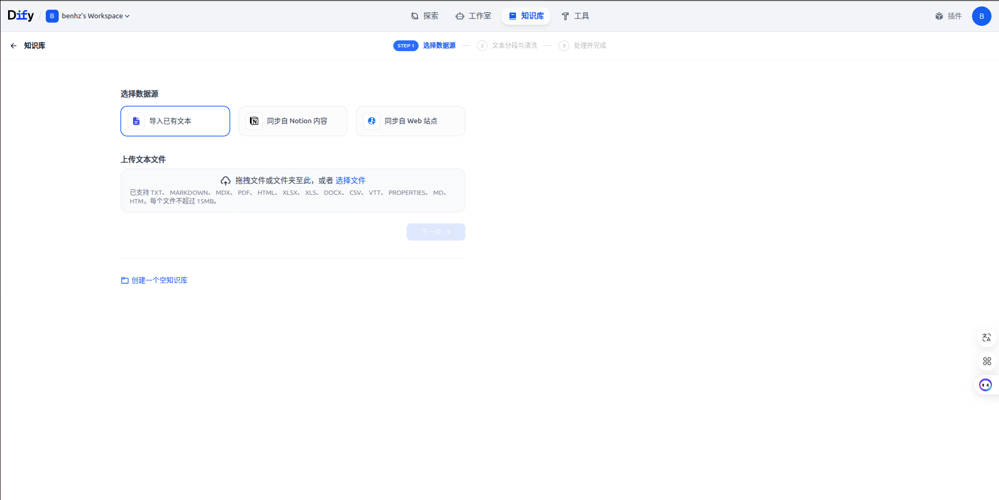
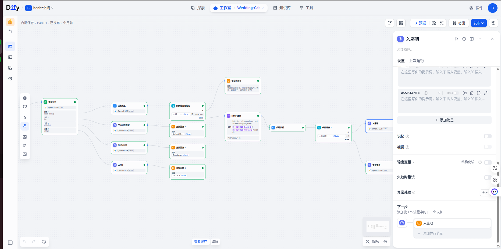

# 智联知识库智能体开发平台概述

## 产品简介

智联知识库智能体开发平台是一款基于开源 LLM 应用开发平台 **Dify** 进行深度定制和二次开发的企业级 AI 应用开发平台。我们在 Dify 的强大基础上，针对企业知识管理和智能体开发场景进行了专项优化，提供从知识库构建、智能体编排到生产部署的全链路解决方案。

通过整合 Dify 的可视化工作流、RAG 引擎、Agent 框架和 LLMOps 能力，结合我们在企业知识管理领域的深厚积累，为企业提供更加专业、易用、可控的 AI 应用开发体验。

**核心定位：**
- 🎯 基于 Dify 的企业级 AI 应用开发平台
- 📚 专注知识库管理与智能问答场景
- 🤖 提供生产级 Agent 智能体开发能力
- 🔒 支持私有化部署，数据安全可控

## 🎯 产品预览

### 在线演示

:::tip 立即体验
👉 [访问演示环境](http://116.178.69.6:30300) - 体验智能体开发全流程

**演示账号：** 请询问muqiao
**演示密码：** 请询问muqiao
:::

### 核心功能展示

#### 1. 知识库管理界面!

*强大的知识库管理，支持多格式文档导入和智能解析*

#### 2. 智能体可视化配置

*拖拽式智能体开发，零代码快速构建 AI 助手*

#### 3. 对话流程设计器

*可视化对话流程编排，轻松实现复杂对话逻辑*

#### 4. RAG 检索效果展示

*精准的语义检索和智能问答，提升用户体验*

#### 5. 多渠道部署

*一键部署到网页、移动端、企业微信等多个渠道*

### 互动演示

<div style={{background: '#f5f5f5', padding: '1.5rem', borderRadius: '8px', margin: '1.5rem 0'}}>
  <h4>💬 试试与智能助手对话</h4>
  <p><strong>你：</strong>如何创建知识库？</p>
  <p><strong>智能助手：</strong>创建知识库非常简单！您可以按照以下步骤操作：</p>
  <ol>
    <li>登录平台后，点击左侧菜单"知识库"</li>
    <li>点击"创建知识库"按钮</li>
    <li>填写知识库名称和描述</li>
    <li>选择 Embedding 模型</li>
    <li>点击"创建"即可完成</li>
  </ol>
  <p style={{marginTop: '1rem', fontSize: '0.9rem', color: '#666'}}>
    👉 <a href="https://demo.knowledge-agent.platform.com/chat" target="_blank">点击这里</a> 开始完整对话体验
  </p>
</div>

### 视频教程

<div style={{background: 'linear-gradient(135deg, #667eea 0%, #764ba2 100%)', padding: '3rem 2rem', borderRadius: '12px', textAlign: 'center', color: 'white', margin: '1.5rem 0'}}>
  <div style={{fontSize: '3rem', marginBottom: '1rem'}}>🎬</div>
  <h3 style={{color: 'white', marginBottom: '1rem'}}>视频教程即将上线</h3>
  <p style={{fontSize: '1.1rem', opacity: 0.9, marginBottom: '1.5rem'}}>
    我们正在精心制作产品演示视频，敬请期待
  </p>
  <div style={{fontSize: '0.9rem', opacity: 0.8}}>
    📹 内容包括：平台介绍、功能演示、快速上手指南等
  </div>
</div>

### 快速导航

<div style={{display: 'flex', gap: '1rem', flexWrap: 'wrap', margin: '1.5rem 0'}}>
  <a href="#快速开始" style={{padding: '0.75rem 1.5rem', background: '#FF6B6B', color: 'white', borderRadius: '6px', textDecoration: 'none', fontWeight: '600'}}>🚀 快速开始</a>
  <a href="./features" style={{padding: '0.75rem 1.5rem', background: '#4ECDC4', color: 'white', borderRadius: '6px', textDecoration: 'none', fontWeight: '600'}}>⚙️ 功能详解</a>
  <a href="./user-guide" style={{padding: '0.75rem 1.5rem', background: '#95E1D3', color: 'white', borderRadius: '6px', textDecoration: 'none', fontWeight: '600'}}>📘 使用手册</a>
  <a href="./faq" style={{padding: '0.75rem 1.5rem', background: '#F38181', color: 'white', borderRadius: '6px', textDecoration: 'none', fontWeight: '600'}}>❓ 常见问题</a>
</div>

---

## 核心价值

### 🎨 可视化 AI 工作流编排（源自 Dify）
- **拖拽式画布设计**：无需编码，通过可视化界面构建复杂 AI 应用
- **丰富节点类型**：LLM 调用、知识库检索、代码执行、HTTP 请求、条件判断、循环等 90+ 内置节点
- **流程调试**：实时查看每个节点的执行结果，快速定位问题
- **工作流模板**：提供客服、内容生成、数据分析等场景的预置工作流

### 📚 企业级知识库管理
- **多格式文档支持**：PDF、Word、PPT、Excel、Markdown、HTML、TXT 等
- **智能文档解析**：自动提取文档结构、表格、图片（OCR）
- **灵活切片策略**：支持按段落、语义、固定长度等多种切片方式
- **知识质量管理**：重复检测、低质过滤、版本管理

### 🤖 Agent 智能体开发（基于 Dify Agent 框架）
- **Function Calling**：基于 LLM 函数调用构建智能体
- **ReAct 推理**：支持 ReAct（Reasoning + Acting）推理模式
- **90+ 内置工具**：Google 搜索、DALL·E、Stable Diffusion、WolframAlpha、天气查询等
- **自定义工具**：通过 API 或代码扩展自定义工具能力
- **多步推理**：支持复杂任务的多步骤分解和执行

### 🎯 强大的 RAG 检索能力
- **混合检索**：向量检索 + 全文检索 + 知识图谱检索
- **语义理解**：支持 OpenAI、Cohere、本地化等多种 Embedding 模型
- **重排序优化**：使用 Rerank 模型提升检索精度
- **上下文管理**：智能控制上下文长度，平衡成本与效果

### 🔧 LLMOps 全生命周期管理
- **Prompt 工程**：可视化 Prompt 编辑器，支持变量、Few-Shot 示例
- **应用监控**：实时监控应用调用、成本、性能指标
- **日志分析**：完整的请求日志，支持按时间、用户、场景过滤
- **持续优化**：基于用户反馈和标注数据持续改进应用效果
- **A/B 测试**：支持多版本并行测试，数据驱动优化

### 🌐 全链路模型支持（继承 Dify）
- **OpenAI 系列**：GPT-4、GPT-3.5、DALL·E 3
- **Anthropic Claude**：Claude 3.5、Claude 3
- **开源模型**：Llama 3、Mistral、Mixtral
- **国产大模型**：通义千问、文心一言、智谱 GLM、百川、MiniMax
- **私有化部署**：支持任何 OpenAI API 兼容的模型

### 🚀 灵活的部署与集成
- **多渠道接入**：Web Widget、移动 SDK、API、Webhook
- **后端即服务（BaaS）**：所有功能均提供 RESTful API
- **第三方集成**：企业微信、钉钉、飞书、Slack
- **私有化部署**：支持 Docker、Kubernetes 部署，数据完全自主可控

## 产品架构（基于 Dify 技术栈）

```
┌─────────────────────────────────────────────────────────────┐
│                  应用层 - 多端访问                          │
│   Web Portal │ Mobile App │ API/SDK │ 第三方集成          │
├─────────────────────────────────────────────────────────────┤
│              前端界面 - 可视化开发体验                       │
│  工作流画布 │ Prompt 编辑器 │ 知识库管理 │ 监控看板       │
├─────────────────────────────────────────────────────────────┤
│                 应用层 - Dify 应用引擎                      │
│  Chatbot │ Agent │ Workflow │ Completion (文本生成)      │
├─────────────────────────────────────────────────────────────┤
│                   核心能力层                                │
│ ┌──────────┬──────────┬──────────┬──────────┬─────────┐  │
│ │LLM 编排  │RAG 引擎  │Agent框架 │工具调用  │变量管理 │  │
│ │Prompt    │混合检索  │Function  │90+工具   │上下文   │  │
│ │Few-Shot  │重排序    │ReAct     │自定义API │会话记忆 │  │
│ └──────────┴──────────┴──────────┴──────────┴─────────┘  │
├─────────────────────────────────────────────────────────────┤
│                   模型抽象层                                │
│  模型适配器 │ Token 计数 │ 流式输出 │ 错误重试           │
├─────────────────────────────────────────────────────────────┤
│                LLM Provider 层                              │
│ OpenAI│Claude│Llama│通义千问│文心│GLM│自定义模型          │
├─────────────────────────────────────────────────────────────┤
│                 数据存储层                                  │
│ ┌──────────┬──────────┬──────────┬──────────┬─────────┐  │
│ │向量数据库│关系数据库│对象存储  │缓存      │消息队列 │  │
│ │Qdrant/   │PostgreSQL│S3/MinIO  │Redis     │Celery   │  │
│ │Weaviate  │          │          │          │         │  │
│ └──────────┴──────────┴──────────┴──────────┴─────────┘  │
├─────────────────────────────────────────────────────────────┤
│              基础设施层                                     │
│  Docker/K8s │ 监控告警 │ 日志收集 │ 备份恢复              │
└─────────────────────────────────────────────────────────────┘
```

### 架构特点

1. **分层设计**：清晰的分层架构，易于扩展和维护
2. **模型无关**：通过抽象层支持任意 LLM，避免厂商锁定
3. **插件化**：工具和功能以插件形式集成，灵活扩展
4. **云原生**：支持容器化部署，弹性伸缩

## 主要功能模块

### 1. 应用类型（继承 Dify 四大应用）

#### Chatbot（对话型应用）
- 持续的多轮对话，基于知识库回答问题
- 适合客服、问答助手等场景
- 支持会话记忆、上下文理解

#### Agent（智能体应用）
- 基于 Function Calling 或 ReAct 的智能体
- 自主调用工具完成复杂任务
- 适合自动化工作流、智能助理

#### Workflow（工作流应用）
- 可视化编排复杂业务流程
- 支持条件分支、循环、并发
- 适合内容生成、数据处理等

#### Completion（文本生成）
- 单次问答，根据提示词生成内容
- 适合文本翻译、摘要、改写等

### 2. 知识库管理

#### 文档导入
- **多格式支持**：PDF、Word、PPT、Excel、Markdown、HTML、TXT、CSV
- **批量操作**：文件夹批量上传、URL 批量抓取
- **API 同步**：通过 API 自动同步文档
- **定时更新**：定时抓取网页或 API 数据

#### 智能解析
- **文档结构识别**：自动提取标题层级、段落结构
- **表格提取**：识别并结构化表格数据
- **图片 OCR**：提取图片中的文字信息
- **代码识别**：保留代码格式和高亮

#### 知识切片
- **语义切片**：基于 NLP 的智能语义分段
- **段落切片**：按段落自然分割
- **固定长度**：按 Token 数量分割
- **自定义规则**：支持正则表达式等自定义规则

### 3. 工作流编排

#### 节点类型
- **LLM 节点**：调用大语言模型
- **知识库检索**：从知识库检索相关内容
- **代码执行**：执行 Python/JavaScript 代码
- **HTTP 请求**：调用外部 API
- **条件分支**：IF/ELSE 逻辑判断
- **循环节点**：迭代处理列表数据
- **变量聚合**：合并多个变量
- **模板转换**：使用 Jinja2 模板

#### 调试能力
- **单步执行**：逐节点调试
- **变量查看**：查看每个节点的输入输出
- **日志记录**：完整的执行日志
- **错误追踪**：快速定位问题节点

### 4. Agent 智能体

#### 内置工具库（90+ 工具）
- **搜索类**：Google、Bing、Wikipedia、DuckDuckGo
- **AI 生成**：DALL·E 3、Stable Diffusion
- **数据处理**：WolframAlpha、数学计算
- **实用工具**：天气查询、汇率转换、时间查询
- **开发工具**：代码执行、API 调试

#### 自定义工具
- **OpenAPI 导入**：通过 OpenAPI/Swagger 规范导入
- **自定义 API**：配置 HTTP 请求参数
- **代码工具**：编写 Python 函数作为工具

### 5. Prompt 工程

#### Prompt 编辑器
- **变量注入**：`{{variable}}` 语法
- **Few-Shot 示例**：提供示例引导模型
- **系统提示词**：定义 AI 角色和行为规范
- **Jinja2 模板**：复杂逻辑编排

#### Prompt 优化
- **版本管理**：保存多个 Prompt 版本
- **A/B 测试**：对比不同 Prompt 效果
- **历史记录**：查看所有历史版本

### 6. MCP 协议支持（2025 新特性）

#### Model Context Protocol
- **标准化集成**：通过 MCP 协议统一访问外部服务
- **预授权模式**：提前配置 API 密钥，用户无需授权
- **免授权模式**：访问公开数据无需授权
- **HTTP 支持**：基于 HTTP 的 MCP 服务（协议版本 2025-03-26）

#### 应用场景
- 访问企业内部数据库
- 集成 CRM、ERP 等业务系统
- 连接第三方 SaaS 服务
- 调用私有化部署的 API

### 7. 检索优化

#### 混合检索策略
- **向量检索**：语义相似度搜索
- **全文检索**：关键词精确匹配
- **权重调节**：自定义向量和关键词权重
- **Top-K 选择**：控制召回数量

#### Rerank 重排序
- **Cohere Rerank**：商用重排序模型
- **BGE Rerank**：开源中文重排序
- **自定义规则**：基于元数据、时间等重排

### 8. 应用部署与集成

#### API 服务
```bash
# 发送消息
POST /v1/chat-messages
# 获取对话历史
GET /v1/messages
# 反馈评价
POST /v1/messages/:id/feedbacks
```

#### SDK 集成
- **Python SDK**：官方 Python 客户端
- **JavaScript SDK**：前端集成
- **iOS/Android SDK**：移动端原生集成

#### Web Widget
- 一行代码嵌入网页
- 自定义样式和位置
- 支持触发条件配置

## 适用场景

### 企业知识库智能化
构建企业级智能知识库，支持自然语言问答，提高知识利用效率。

### 智能客服助手
开发 24/7 在线的智能客服，自动回答常见问题，提升服务质量。

### 文档智能问答
为产品文档、帮助中心等提供智能问答能力，提升用户体验。

### 领域专家系统
结合行业知识，开发专业领域的 AI 助手和决策支持系统。

## 技术特性

### 性能指标
- **高精度检索**：向量检索准确率 > 95%，混合检索 + Rerank 可达 98%
- **低延迟响应**：平均响应时间 < 2 秒，支持流式输出降低首字延迟
- **高并发支持**：支持 10000+ QPS，支持水平扩展
- **高可用性**：支持集群部署，99.9% 服务可用性

### 模型支持（继承 Dify 生态）

#### 商业模型
- **OpenAI**：GPT-4 Turbo、GPT-4、GPT-3.5 Turbo
- **Anthropic**：Claude 3.5 Sonnet、Claude 3 Opus/Sonnet/Haiku
- **Google**：Gemini Pro、Gemini Ultra
- **Cohere**：Command、Command Light

#### 国产大模型
- **阿里云**：通义千问 Turbo、Plus、Max
- **百度**：文心一言 4.0、3.5
- **智谱 AI**：GLM-4、GLM-3-Turbo
- **百川智能**：Baichuan2
- **MiniMax**：abab5.5、abab5.5-chat
- **讯飞**：星火大模型 3.0

#### 开源模型
- **Meta**：Llama 3、Llama 2
- **Mistral**：Mistral 7B、Mixtral 8x7B
- **01.AI**：Yi-34B
- **Qwen**：Qwen-72B

#### 私有化部署
- 支持任何兼容 OpenAI API 的模型
- 支持 Ollama、LocalAI 等本地部署方案
- 支持企业自训练模型接入

### 开源优势（基于 Dify）

#### 社区活跃
- **GitHub Star**：56.5K+（截至 2025 年）
- **贡献者**：活跃的国际化开源社区
- **更新频率**：持续迭代，每月多次版本发布
- **生态丰富**：大量社区贡献的工具和插件

#### 完全可控
- **数据主权**：所有数据存储在您的服务器
- **代码透明**：完整源代码，可审计、可定制
- **无供应商锁定**：避免依赖单一厂商
- **合规保障**：满足金融、医疗等行业合规要求

#### 企业级特性
- **SSO 单点登录**：集成企业身份认证系统
- **RBAC 权限控制**：细粒度的角色权限管理
- **审计日志**：完整的操作审计记录
- **数据加密**：传输加密（TLS）+ 存储加密

#### 部署灵活
- **Docker 部署**：一键启动，5 分钟完成部署
- **Kubernetes**：云原生部署，支持弹性伸缩
- **私有云**：支持各种私有云环境
- **混合云**：灵活的混合云架构

## 快速开始

1. [创建知识库](./user-guide.md#创建知识库)
2. [导入文档](./user-guide.md#导入文档)
3. [配置智能体](./user-guide.md#配置智能体)
4. [测试与部署](./user-guide.md#测试部署)

## 我们基于 Dify 做的增强

智联知识库智能体开发平台在 Dify 的基础上，针对企业知识管理场景做了以下增强：

| 功能领域 | Dify 原生能力 | 我们的增强 |
|---------|--------------|-----------|
| **知识库管理** | 基础文档导入和检索 | • 企业级文档管理系统<br />• 知识审核工作流<br />• 知识版本控制<br />• 知识质量评分 |
| **文档解析** | 标准文档解析 | • 增强的 OCR 识别<br />• 复杂表格提取<br />• 多语言文档支持<br />• 自定义解析规则 |
| **检索优化** | 基础 RAG 能力 | • 知识图谱增强检索<br />• 行业定制 Embedding<br />• 智能问题改写<br />• 多路召回融合 |
| **权限管理** | 基础权限控制 | • 细粒度知识库权限<br />• 部门级数据隔离<br />• 数据脱敏机制<br />• 操作审计日志 |
| **企业集成** | 标准 API | • 企业系统深度集成<br />• 统一身份认证<br />• 数据同步中间件<br />• 自定义 Webhook |
| **监控运维** | 基础监控 | • 全链路性能监控<br />• 智能告警系统<br />• 成本分析报表<br />• 容量规划建议 |
| **行业适配** | 通用平台 | • 金融行业合规<br />• 医疗数据安全<br />• 政企私有化<br />• 行业模板库 |

## 为什么选择我们而非直接使用 Dify？

### 1. 企业级知识管理
我们在 Dify 的基础上，专门针对企业知识管理场景进行了深度优化，提供更专业的知识库管理能力。

### 2. 开箱即用的企业特性
预置了企业常用的权限管理、审计日志、数据脱敏等功能，无需二次开发。

### 3. 专业服务支持
提供专业的技术支持、培训服务、定制开发，助力企业快速落地。

### 4. 行业最佳实践
基于大量企业实施经验，提供行业最佳实践和应用模板。

### 5. 持续的功能增强
在保持与 Dify 社区同步的同时，持续增强企业级特性。

## 关于 Dify

[Dify](https://dify.ai) 是一款开源的 LLM 应用开发平台，由 Dify.AI 团队开发并维护。它在 GitHub 上获得了 56.5K+ Star（截至 2025 年），是目前最受欢迎的开源 AI 应用开发平台之一。

**Dify 采用 Apache 2.0 开源协议**，允许商业使用和二次开发。我们感谢 Dify 社区的杰出工作，并致力于将我们的增强功能回馈社区。

**了解更多 Dify：**
- 官网：https://dify.ai
- GitHub：https://github.com/langgenius/dify
- 文档：https://docs.dify.ai

## 下一步

- 查看 [功能详解](./features.md) 了解更多功能
- 阅读 [使用手册](./user-guide.md) 快速上手
- 查看 [常见问题](./faq.md) 解决疑问
- [访问演示环境](http://116.178.69.6:30300) 立即体验
